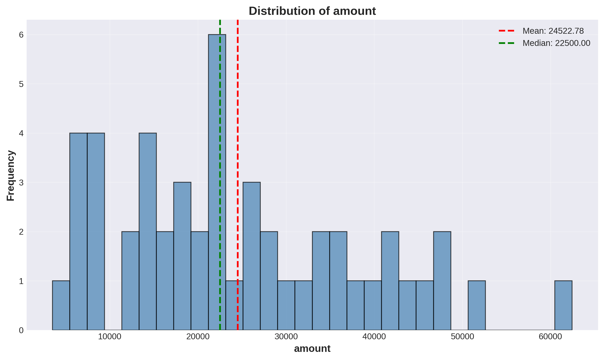
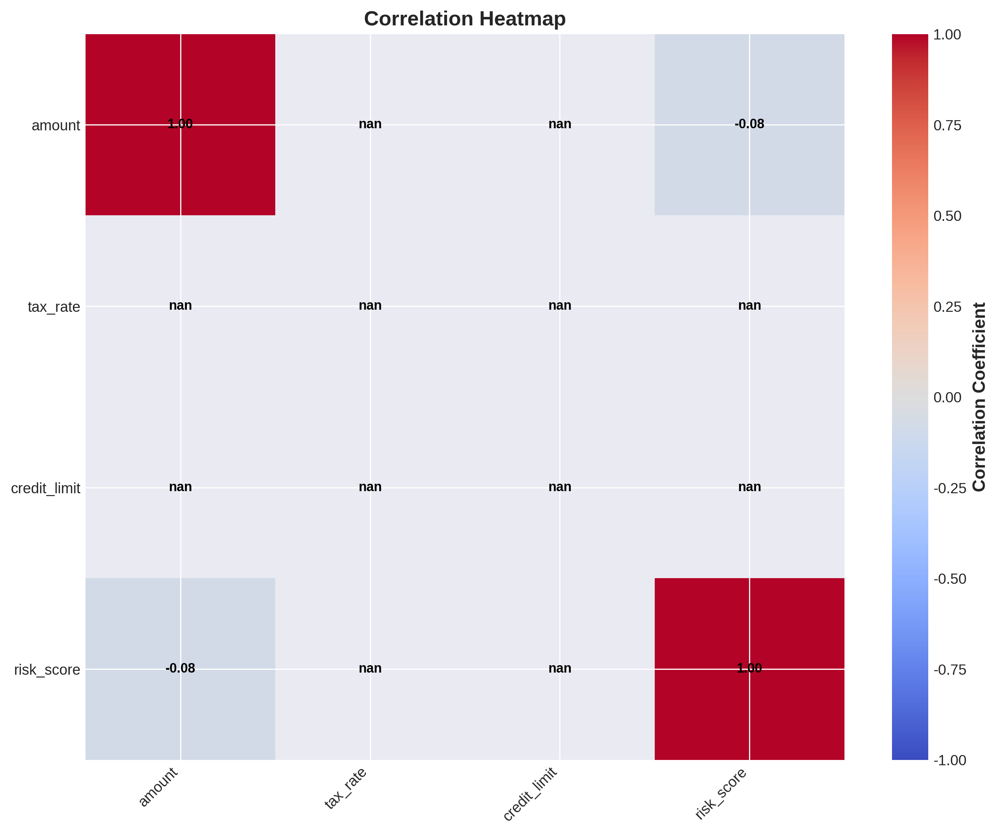
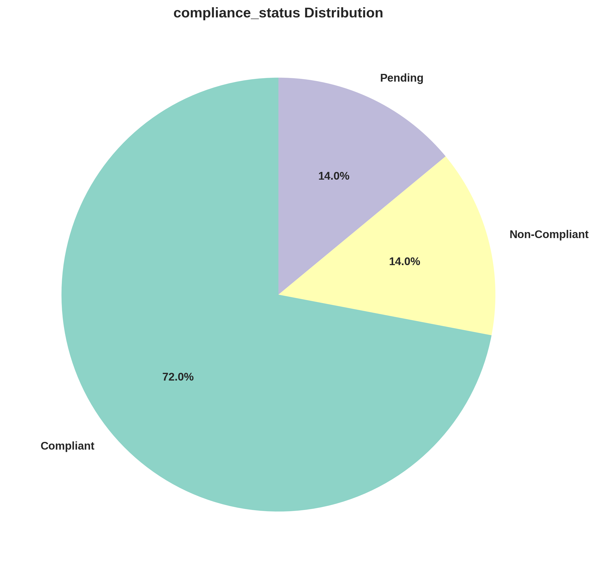
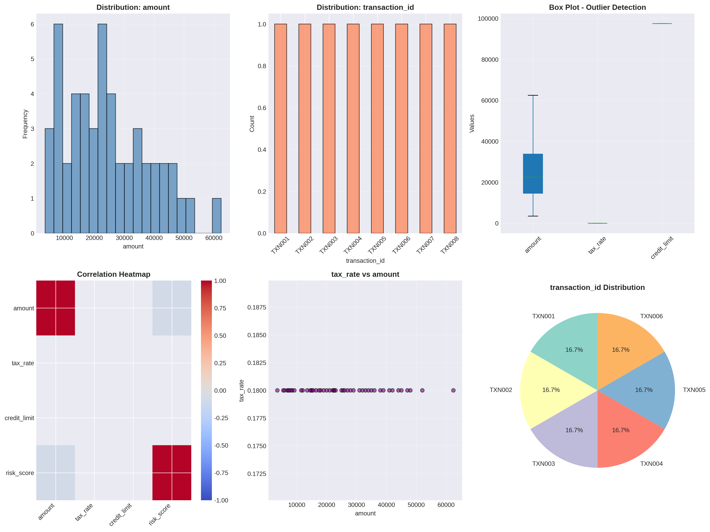

'''
# Automated Data Cleaning and Analysis Pipeline

This project provides a complete, ready-to-run data science pipeline for automated data cleaning, analysis, and visualization. It is designed as a practical example for data science freshers to understand the end-to-end workflow of a typical data project.

## 🚀 Features

- **Modular Design**: The project is structured into separate modules for data loading, cleaning, analysis, and visualization, promoting code reusability and maintainability.
- **Multiple Data Sources**: Demonstrates how to load and integrate data from both CSV files and a SQLite database.
- **Comprehensive Data Cleaning**: Implements robust procedures for handling missing values, removing duplicates, and detecting/handling outliers.
- **In-depth Data Analysis**: Performs exploratory data analysis (EDA) including descriptive statistics, correlation analysis, and categorical data review.
- **Rich Visualizations**: Generates a variety of plots and charts using Matplotlib to present data insights effectively, including a summary dashboard.
- **Automated Pipeline**: A single main script (`main.py`) orchestrates the entire workflow, making it easy to execute.

## 📂 Project Structure

The project follows a standard data science project structure:

```
📁 automated_data_pipeline/
 ├── 📁 data/
 │    └── raw_data.csv
 ├── 📁 sql/
 │    └── database.db
 ├── 📁 src/
 │    ├── data_loader.py
 │    ├── data_cleaning.py
 │    ├── data_analysis.py
 │    ├── visualization.py
 │    └── main.py
 ├── 📁 outputs/
 │    ├── (Generated charts and plots)
 ├── requirements.txt
 └── README.md
```

### File Descriptions

- **`data/raw_data.csv`**: Sample raw transaction data in CSV format.
- **`sql/database.db`**: SQLite database containing supplementary customer information.
- **`src/data_loader.py`**: Module for loading data from CSV and SQLite and merging them.
- **`src/data_cleaning.py`**: Module for all data cleaning tasks.
- **`src/data_analysis.py`**: Module for performing exploratory data analysis.
- **`src/visualization.py`**: Module for creating and saving data visualizations.
- **`src/main.py`**: The main script that runs the entire pipeline from start to finish.
- **`outputs/`**: Directory where all generated visualizations are saved.
- **`requirements.txt`**: A list of all Python libraries required to run the project.
- **`README.md`**: This file, providing a complete overview of the project.

## ⚙️ Setup and Installation

Follow these steps to set up and run the project on your local machine.

### 1. Prerequisites

- Python 3.8 or higher
- `pip` (Python package installer)

### 2. Clone the Repository

First, clone this repository to your local machine:

```bash
git clone <repository-url>
cd automated_data_pipeline
```

### 3. Install Dependencies

Install the required Python libraries using the `requirements.txt` file:

```bash
pip install -r requirements.txt
```

This will install the following libraries:
- `pandas`
- `numpy`
- `matplotlib`

## ▶️ How to Run the Pipeline

To execute the entire data processing pipeline, run the `main.py` script from the project's root directory:

```bash
python src/main.py
```

The script will perform the following steps and print the progress in the console:

1.  **Load Data**: Loads transaction data from `data/raw_data.csv` and customer data from `sql/database.db`.
2.  **Merge Data**: Combines the two datasets into a single DataFrame.
3.  **Clean Data**: Handles missing values, removes duplicates, and caps outliers.
4.  **Analyze Data**: Computes descriptive statistics, correlations, and group-based analyses.
5.  **Generate Visualizations**: Creates and saves multiple plots (histograms, bar charts, heatmaps, etc.) to the `outputs/` directory.

Upon successful completion, you will find all the generated charts and a summary dashboard in the `outputs/` folder.

## 📊 Sample Visualizations

Here are some examples of the visualizations generated by the pipeline:

*(Note: These are placeholders. The actual charts will be generated in the `outputs` directory when you run the script.)*

| Amount Distribution | Category Distribution |
| :---: | :---: |
|  |  |

| Correlation Heatmap | Compliance Status |
| :---: | :---: |
|  |  |

### Summary Dashboard

A comprehensive dashboard summarizing key insights will also be generated:



## 🧑‍💻 About the Author

This project was created by a **Data Science Engineer** as a demonstration of best practices in building automated data pipelines. It is intended for educational purposes and to serve as a template for similar data science projects.
'''
